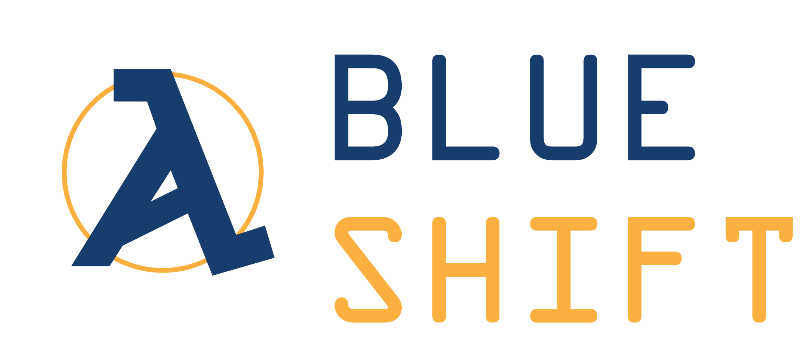

# FTC SkyStone
> SkyStone robot code created by the programmers of Team Blue Shift [FTC5549].

This repository is the version control hub of Team Blue Shift [FTC5549] for the FIRST Tech Challenge 2019-2020 event "SkyStone". Updating nearly daily, the repository will include a collection of Autonomous and TeleOP programs as well as custom libraries and objects used during our team's competition matches.

Blue Shift shares all of our code so that other teams may learn from our programming and so that we may also learn from others. We are completely transparent with our progress. This project is entirely dedicated to a special member of our community, Crow Thorsen. His never-failing support for the robotics team has continuously boosts our spirits and we are forever thankful.

## Release History

* 0.1.0
    * TeleOP Skeleton

Base application [ftc_app]: https://github.com/ftctechnh/ftc_app.

## Meta

Kevin Jones  - [kevinjones557](https://github.com/robo19/) - jonesk22@ashevilleschool.org  

[https://github.com/BlueShift-FTC5549/SkyStone](https://github.com/BlueShift-FTC5549/)
